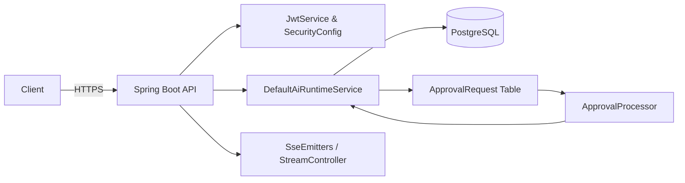

# Backend Architecture — SmartCAMPOST

Overview
- Purpose: backend services for SmartCAMPOST — authentication, parcels, deliveries, payments, AI runtime, approvals, SSE events and domain services.
- Stack: Java 17, Spring Boot (Maven), Spring Security (JWT), JPA (PostgreSQL), scheduling, SSE (SseEmitter), Redis (optional), Kafka/RabbitMQ (pluggable), background processors.

Core subsystems
- API / Controllers: [backend/src/main/java/com/smartcampost/backend/controller](backend/src/main/java/com/smartcampost/backend/controller)
- Authentication & Security: [backend/src/main/java/com/smartcampost/backend/security/SecurityConfig.java](backend/src/main/java/com/smartcampost/backend/security/SecurityConfig.java)
- AI runtime & tooling: [backend/src/main/java/com/smartcampost/backend/ai/runtime/DefaultAiRuntimeService.java](backend/src/main/java/com/smartcampost/backend/ai/runtime/DefaultAiRuntimeService.java)
- Approval queue & processor: [backend/src/main/java/com/smartcampost/backend/approval/ApprovalRequest.java](backend/src/main/java/com/smartcampost/backend/approval/ApprovalRequest.java) and [backend/src/main/java/com/smartcampost/backend/approval/ApprovalProcessor.java](backend/src/main/java/com/smartcampost/backend/approval/ApprovalProcessor.java)
- Domain services (assignment, delivery, payment): [backend/src/main/java/com/smartcampost/backend/service](backend/src/main/java/com/smartcampost/backend/service)
- Persistence / Repositories: [backend/src/main/java/com/smartcampost/backend/repository](backend/src/main/java/com/smartcampost/backend/repository)

Eventing and realtime
- SSE endpoint used by frontend/mobile: [backend/src/main/java/com/smartcampost/backend/controller/StreamController.java](backend/src/main/java/com/smartcampost/backend/controller/StreamController.java)
- SseEmitters registry publishes `AiOperationalEvent` events from the runtime.

Background processing
- ApprovalProcessor: scheduled worker that replays approved requests to the AiRuntime for execution.
- Scheduling is enabled in [backend/src/main/java/com/smartcampost/backend/config/BackendConfig.java](backend/src/main/java/com/smartcampost/backend/config/BackendConfig.java)

Security considerations (high level)
- JWT for stateless auth: [backend/src/main/java/com/smartcampost/backend/security/JwtService.java](backend/src/main/java/com/smartcampost/backend/security/JwtService.java)
- JWT filter allows SSE tokens via query param for EventSource: [backend/src/main/java/com/smartcampost/backend/security/JwtAuthFilter.java](backend/src/main/java/com/smartcampost/backend/security/JwtAuthFilter.java)
- Account lockout, rate limiting and CORS policies are enforced server-side.

Diagram (high level)

References
- See detailed route and API docs in BACKEND_ROUTES.md and BACKEND_APIS.md.
