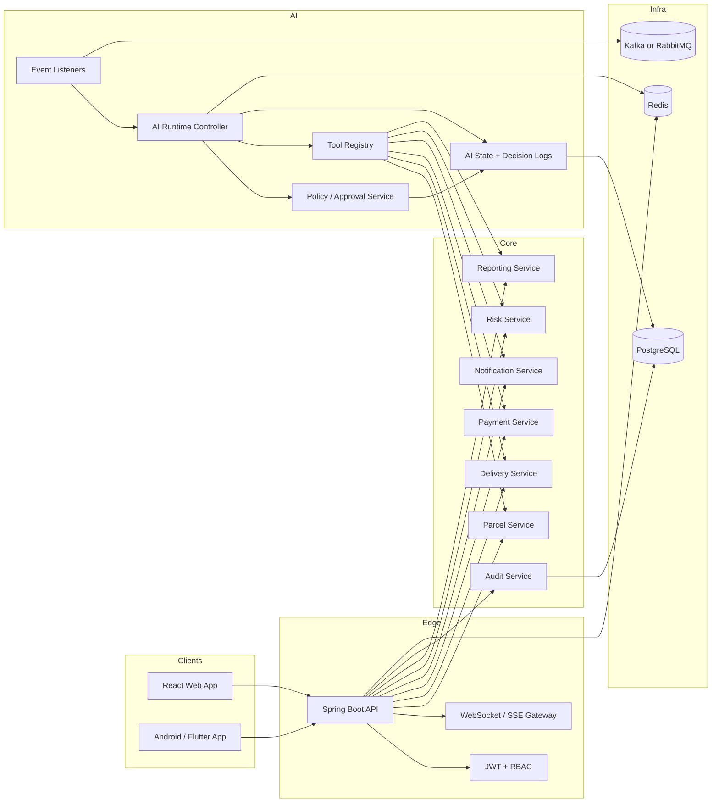

# SmartCAMPOST AI Platform Architecture

## Goals

The AI layer is split into two operating modes:

- Reactive mode: answer user questions, retrieve data, explain results, and never mutate state unless the backend validates an explicit action request.
- Proactive mode: observe domain events, infer operational opportunities, request approvals for sensitive actions, execute safe tools, and audit every step.

The backend remains the system of record. AI only acts through backend services and never talks directly to the database.

## Enterprise Architecture

## Microservice Decomposition

- API gateway / backend API: auth, RBAC, parcel APIs, delivery APIs, payment APIs, notifications, audit, AI endpoints.
- AI orchestration module: reactive chat, proactive event processing, tool registry, approval policy, state persistence.
- Event backbone: Kafka preferred for operational events; RabbitMQ is acceptable for lighter deployments.
- Notification service: SMS, email, push, and webhook fan-out.
- Payment integration service: MTN Mobile Money, Orange Money, gateway callbacks, webhook validation, and reconciliation.

## PostgreSQL Schema

Core business tables already in the system should remain the source of truth. The AI layer adds or reuses these tables:

- `ai_agent_state`: persistent AI module state and confidence.
- `ai_decision_log`: reasoning trail for AI decisions.
- `ai_execution_log`: actual action execution history.
- `conversation` and `conversation_message`: chat history and assistant context.
- `audit_log` and scan event tables: business audit trail and parcel timeline.

Recommended future tables:

- `ai_tool_registry`: tool metadata and versioned policy flags.
- `ai_action_approval`: approval queue for sensitive actions.
- `ai_event_outbox`: transactional event publication.
- `payment_webhook_receipt`: signed gateway callback records.

## RBAC and Permission Model

Roles are dynamic and database-driven. The AI layer should not hardcode role names in business logic. Permissions are the primary guardrail.

Recommended permission families:

- `parcel:read`, `parcel:write`, `parcel:assign`
- `delivery:read`, `delivery:write`
- `payment:read`, `payment:write`, `payment:verify`
- `report:read`, `report:export`
- `risk:read`, `risk:write`, `risk:freeze`
- `notification:send`
- `ai:chat`, `ai:tool.execute`, `ai:event.process`, `ai:approve`

The orchestration layer must validate:

- authenticated identity
- granted permissions
- ownership rules
- workflow state
- approval status for sensitive actions

## AI Orchestration

The runtime follows a stateful decision pipeline:

1. Event or user message arrives.
2. Context is assembled from authentication, entity state, and business rules.
3. Policy layer decides allow / deny / requires approval.
4. Tool registry executes the allowed action through backend services.
5. Execution outcome is written to decision and execution logs.
6. Notifications are published to users and staff.

Reactive mode only reads data unless the user explicitly requests an action and the backend authorizes it.

Proactive mode can create recommendations, notify stakeholders, and request approval for risky actions.

## Tool Registry

The first production tool set should include:

- `trackParcelTool`
- `updateDeliveryStatusTool`
- `verifyPaymentTool`
- `generateReportTool`
- `notifyUserTool`
- `detectFraudTool`
- `assignCourierTool`

Tool execution must always go through backend validation and audit logging.

## Event-Driven Intelligence

The AI runtime should subscribe to existing domain events and future broker events.

Supported signals:

- `PARCEL_CREATED`
- `COURIER_AVAILABLE`
- `COURIER_ASSIGNED`
- `DELIVERY_STARTED`
- `DELIVERY_DELAYED`
- `DELIVERY_COMPLETED`
- `PAYMENT_RECEIVED`
- `PAYMENT_FAILED`
- `FRAUD_SUSPECTED`
- `SYSTEM_ALERT`

## WebSocket / Realtime Design

- Use WebSocket or SSE for live AI notifications and operational updates.
- Push tool execution results, approval requests, delivery state changes, and payment callbacks.
- The mobile app and React frontend should subscribe to a user-scoped channel plus a role-scoped channel.

## Payment Integration Flow

1. User creates parcel or delivery payment request.
2. Backend creates a payment record and sends the gateway request.
3. MTN or Orange Money callback is validated with signature or reference checks.
4. Payment is reconciled in PostgreSQL.
5. Notification and invoice services are triggered.
6. AI may flag anomalies or recommend intervention, but never confirms payment without backend validation.

## Audit Logging

Every AI action should write:

- decision log: why a tool was chosen or denied
- execution log: what happened and whether it succeeded
- approval reference: who approved a sensitive action
- correlation id: request / event traceability

## Failure Handling

- Retries should be idempotent and correlation-id aware.
- Mutating tools must be safe to replay or explicitly rejected as duplicates.
- Failed actions should emit notifications and remain visible in audit logs.
- Approval-required actions should stay pending until a human approves them.

## Deployment

- Build the backend as a Docker image.
- Use PostgreSQL and Redis as managed state stores.
- Use Kafka or RabbitMQ for domain event fan-out.
- Keep AI secrets in environment variables or a secrets manager.
- Expose the AI runtime behind the same authenticated API as the rest of the backend.

## Implementation Notes

The repository now includes a governed AI runtime package that:

- exposes a reactive chat endpoint
- processes operational events
- executes backend tools through a policy layer
- writes AI decision and execution logs
- integrates with existing domain events for proactive intelligence
